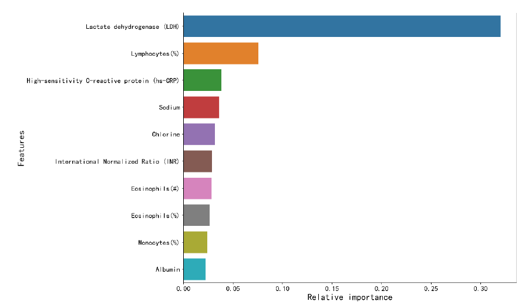
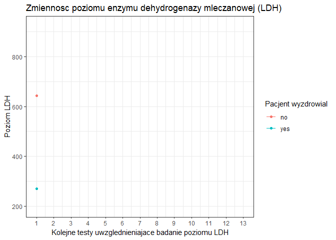
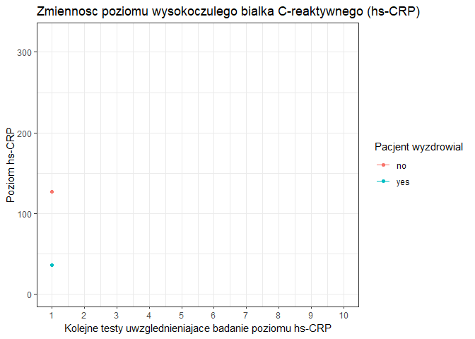
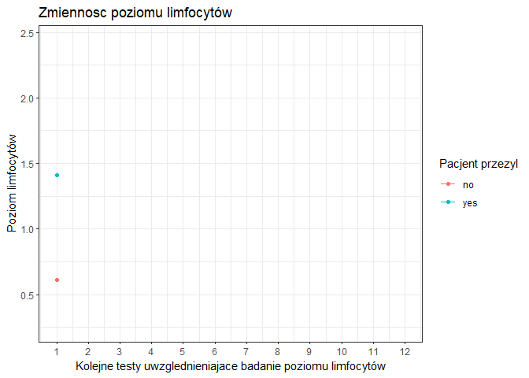

# Executive summary

Niniejszy raport zawiera analizę danych pacjentów chorych na koronawirusa przyjętych do szpitala Tongji w Wuhan na przełomie stycznia i lutego 2020 roku.  W raporcie uwględnione zostały analizy wraz z wykresami przedstawiające zależności pomiędzy różnymi cechami pacjentów a śmiertelnością. Analizowanymi atrybutami były między innymi: dane demograficzne pacjentów (płeć, wiek, etc.) oraz dane medyczne pacjentów powstałe w wyniku wykonanych na nich badaniach krwi. W raporcie przedstawione zostały również korelacje pomiędzy różnymi biomarkerami oraz dołączone zostały wykresy zmienności najbardziej kluczowych atrybutów na przestrzeni kolejnych badań. W ostatnim rozdziale raportu stworzony został klasyfikator dokonujący predykcji śmiertelności pacjenta zakażonego koronawirusem. Dokładność opisanego klasyfikatora osiągnęła poziom 96.55%.

# Wykorzystane biblioteki
```{r libraries, message=FALSE}
library(readxl)
library(httr)
library(knitr)
library(plyr)
library(gridExtra)
library(tidyverse)
library(janitor)
library(scales)
library(kableExtra)
library(qwraps2)
library(rmarkdown)
library(caret)
library(reshape2)
library(plotly)
library(naniar)
library(gganimate)
```

# Wczytywanie danych

```{r data_url, echo=FALSE}
url <- "http://www.cs.put.poznan.pl/dbrzezinski/teaching/zed/wuhan_blood_sample_data_Jan_Feb_2020.xlsx"
```

Surowe dane zostały pobrane z adresu url (`r url`) bezpośrednio bez konieczności ręcznego pobierania zbioru danych w celu zapewnienia powtarzalności eksperymentów.

```{r data_download, results='hide'}
GET(url, write_disk(data_file <- tempfile(fileext = ".xlsx")))
raw_df <- read_excel(data_file) 
```


# Przetwarzanie zbioru danych

```{r data_cleanup, echo=FALSE}
df <- raw_df %>% 
  rename(
    c(
      patient_id=PATIENT_ID, 
      test_date=RE_DATE, 
      admission_date="Admission time",
      discharge_date="Discharge time", 
      survived=outcome)
    ) %>% 
  fill(patient_id) %>% 
  mutate(survived = ifelse(survived == 0, "yes", "no")) %>%
  mutate(gender = ifelse(gender == 1, "male", "female"))
```

## Rozmiar danych
Zbiór danych składa się z `r nrow(raw_df)` rekordów medycznych opisywanych przez `r ncol(raw_df)` atrybutów, z których pierwsze 7 odnosi się bezpośrednio do samego pacjenta (jego identyfikator, data przyjęcia do szpitala, wiek, ...), a pozostałe `r ncol(raw_df)-7` atrybuty zawierają informacje o wynikach przeprowadzonych badań.

## Pacjenci
```{r patients, echo=FALSE}
patients <- distinct(
  df %>%
    select(patient_id, age, gender, admission_date, discharge_date, survived)) %>%
  mutate(treatment_duration_hours=as.numeric(discharge_date-admission_date), treatment_duration_days=round(difftime(discharge_date, admission_date, units="days"), digits=0))
patients$age_group <- cut(patients$age, seq(10, 100, by=10))
```


Zbiór danych zawiera informacje o `r nrow(patients)` pacjentach, u których stwierdzono obecność choroby COVID-19. Dane zostały zebrane na przestrzeni od `r as.Date(min(patients$admission_date))` do `r as.Date(max(patients$discharge_date))`.

### Atrybuty główne - informacje o pacjentach

* patient_id (PATIENT_ID) - unikalny identyfikator przypisany do każdego pacjenta, 
* test_date (RE_DATE) - pole, którego znaczenie w dokumentacji zbioru nie jest jednoznacznie opisane, ale na podstawie pozostałych atrybutów zbioru można wyprowadzić, że jest to data wykonania badania
* age - wiek pacjenta
* gender - płeć pacjenta, przyjmuje wartości 1 lub 2, gdzie 1 oznacza mężczyznę, a 2 kobietę. Przypisane wartości do płci nie było jawnie udokumentowane, natomiast poprawną identyfikację umożliwiały dopiero opublikowane statystyki zbioru.
* admission_date (Admission time) - data przyjęcia pacjenta do szpitala.
* discharge_date (Discharge time) - data wypisania pacjenta ze szpitala w przypadku ozdrowienia lub data śmierci.
* survived (outcome) - wynik przebytej przez pacjenta choroby, przyjmuje wartości 0 lub 1, gdzie 0 oznacza wyleczenie, a 1 - śmierć. Przypisanie odpowiedniego wyniku do wartości atrybutu było możlwie dzięki dostępnym statystykom zbioru, podobnie jak w przypadku atrybutu 'gender'.

### Dane demograficzne pacjentów

```{r demographics, echo=FALSE, warning=FALSE}
age_group_count <- tabyl(patients, age_group) %>% 
  select(age_group, n) 
age_group_count <- age_group_count %>%  
  arrange(desc(age_group)) %>%
  mutate(prop=n/sum(age_group_count$n)*100) %>%
  mutate(ypos=ifelse(n >= 20, cumsum(prop)-0.5*prop, NA)) %>%
#  mutate(ypos=ifelse(n >= 20, cumsum(prop)-0.5*prop, "")) %>%
  mutate(desc = paste(age_group, percent(prop/100), sep=" - "))

gender_count <- tabyl(patients, gender) %>%
  select(gender, n)
gender_count <- gender_count %>%
  arrange(desc(gender)) %>%
  mutate(prop=n/sum(gender_count$n)*100) %>%
  mutate(ypos=cumsum(prop)-0.5*prop) %>%
  mutate(desc = paste(gender, percent(prop/100), sep=" - "))


age_demographics <- ggplot(age_group_count, aes(x="", y=prop, fill=desc)) +
  geom_bar(stat="identity", width=1, color="white") +
  coord_polar("y", start=0) + 
  theme_void() + 
  geom_text(aes(y = ypos, label = n), color = "white", size=3) + 
  labs(
    title="Struktura wieku pacjentów",
    fill="Grupa wiekowa"
  )


gender_demographics <- ggplot(gender_count, aes(x="", y=prop, fill=desc)) +
  geom_bar(stat="identity", width=1, color="white") +
  coord_polar("y", start=0) +
  theme_void() +
  geom_text(aes(y = ypos, label = n), color = "white", size=6) +
  scale_fill_brewer(palette = "Set1") +
  labs(
    title="Struktura plci pacjentów",
    fill="Plec"
    )
```

Wśród pacjentów najliczniejszą grupę pod względem płci stanowią `r ifelse(gender_count[which.max(gender_count$n), 1] == "male", "mężczyźni", "kobiety")` - `r gender_count[which.max(gender_count$n), 2]` pacjentów (`r percent_format(accuracy = 0.1)(gender_count[which.max(gender_count$n), 3]/100)`). 

Średnia wieku pacjentów wynosi `r round(mean(patients$age), digits=2)`, pełne informacje o rozkładzie wieku pacjetnów dostępne są w tabeli poniżej.
```{r age_demographics_table, echo=FALSE}
data.frame("Min"=as.character(min(patients$age)), 
           "Median"=as.character(median(patients$age)), 
           "Mean"=qwraps2::mean_sd(patients$age), 
           "Max"=as.character(max(patients$age))) %>%
  kable() %>%
  kable_styling("bordered", full_width = F)
```
Dodatkowo do danych o pacjentach dodany został nowy atrybut wyliczeniowy - `age_group` przypisujący pacjentów do dziesięcioletnich grup wiekowych, powstały na podstawie podziału atrybutu numerycznego - `age`. 
Najliczniejszą grupą wiekową wśród pacjentów jest `r age_group_count[which.max(age_group_count$n), 1]` - `r age_group_count[which.max(age_group_count$n), 2]` pacjentów (`r percent_format(accuracy = 0.1)(age_group_count[which.max(age_group_count$n), 3]/100)`), natomiast najmniej liczną grupą jest `r age_group_count[which.min(age_group_count$n), 1]` - `r age_group_count[which.min(age_group_count$n), 2]` pacjentów (`r percent_format(accuracy = 0.1)(age_group_count[which.min(age_group_count$n), 3]/100)`).

Statystyki dotyczące demografii pacjentów zostały również zwizualizowane na wykresach kołowych poniżej:

```{r, echo=FALSE, warning=FALSE, fig.align='center'}
grid.arrange(age_demographics, gender_demographics, ncol=2)
```

### Hospitalizacja

```{r treatment_duration_hours, echo=FALSE}
treatment_parse <- function(durationHours) {
  reminderHours <- durationHours %% 24
  reminderMinutes <- (reminderHours %% 1) * 60
  reminderSeconds <- (reminderMinutes %% 1) * 60
  days <- (durationHours - reminderHours) / 24
  c(days, floor(reminderHours), floor(reminderMinutes), floor(reminderSeconds))
}

treatment_format <- function(duration) {
  parsedDuration <- treatment_parse(duration)
  days <- parsedDuration[1]
  hours <- ifelse(parsedDuration[2]<10, paste("0", parsedDuration[2], sep=""), parsedDuration[2])
  minutes <- ifelse(parsedDuration[3]<10, paste("0", parsedDuration[3], sep=""), parsedDuration[3])
  seconds <- ifelse(parsedDuration[4]<10, paste("0", parsedDuration[4], sep=""), parsedDuration[4])
  c(days, hours, minutes, seconds)
}

min_duration <- treatment_format(min(patients$treatment_duration_hours))
min_duration_string <- paste(min_duration[1], ":", min_duration[2], ":", min_duration[3], ":", min_duration[4], sep="")

mean_duration <- treatment_format(mean(patients$treatment_duration_hours))
mean_duration_string <- paste(mean_duration[1], ":", mean_duration[2], ":", mean_duration[3], ":", mean_duration[4], sep="")

max_duration <- treatment_format(max(patients$treatment_duration_hours))
max_duration_string <- paste(max_duration[1], ":", max_duration[2], ":", max_duration[3], ":", max_duration[4], sep="")
```
 
Minimalnym czasem hospitalizacji był `r min_duration_string` (dd:hh:mm:ss), a maksymalnym - `r max_duration_string`. Średnim czasem jaki pacjenci spędzili w szpitalu był `r mean_duration_string`.

```{r treatment_duration_hours_by_age_group, echo=FALSE, fig.align="center"}
treatment_duration_hours_stats <- patients %>%
  group_by(age_group) %>%
  summarise(Mean=mean(treatment_duration_hours), Max=max(treatment_duration_hours), Min=min(treatment_duration_hours), Standard_deviation=sd(treatment_duration_hours), .groups = "rowwise")
```

```{r treatment_duration_hours_by_age_group_1, echo=FALSE, fig.align="center"}
patients %>% ggplot(aes(x=age_group, y=treatment_duration_hours, fill=age_group)) +
  geom_boxplot(alpha=0.5) +
  theme_bw() +
  theme(legend.position="none") + 
  scale_fill_brewer(palette = "Set1") + 
  labs(
    title="Wykaz czasu hospitalizacji pacjentów z podziałem na grupy wiekowe",
    y="Długość hospitalizacji [h]",
    x="Grupy wiekowe"
    )
```

Pełna dystrybucja czasu hospitalizacji jest przedstawiona w tabeli poniżej:

```{r, echo=FALSE}
convert_treatment_duration <- function(treatment_duration) {
  ret <- treatment_format(treatment_duration)
  paste(ret[1], ":", ret[2], ":", ret[3], ":", ret[4], sep="")
  
}

treatment_duration_hours_stats %>%
  mutate(Mean=convert_treatment_duration(Mean), Max=convert_treatment_duration(Max), Min=convert_treatment_duration(Min), Standard_deviation=convert_treatment_duration(Standard_deviation)) %>%
  kable() %>%
  kable_styling("bordered", full_width = F)
```

### Liczba przeprowadzonych badań

```{r test_per_patient_count, echo=FALSE, warning=FALSE,}
patients_tests <- aggregate(cbind(tests_count=test_date)~patient_id,
                            data=df,
                            FUN=function(x){NROW(x)})
patients <- merge(x=patients, y=patients_tests, by="patient_id") %>%
  mutate(tests_freq=(tests_count/as.numeric(treatment_duration_hours))*24)
```

Pacjenci byli poddawani badaniom ze średnią częstotliwością `r round(mean(patients$tests_freq), digits=2)` badania na dzień. Największą ilością przeprowadzonych badań podczas pobytu pacjenta w szpitalu było - `r max(patients_tests$tests_count)`, natomiast najmniejszą - `r min(patients_tests$tests_count)`.

```{r tests_freq_plot, echo=FALSE, fig.align='center'}
ggplot(data=patients, aes(x=reorder(age_group, -tests_freq), y=tests_freq, fill=age_group)) +
  geom_bar(stat="summary",  fun="mean") + 
  theme_bw() +
  scale_fill_brewer(palette = "Set1") +
  theme(legend.position = "none") +
  labs(
    title="Dzienna częstotliwość przeprowadzania badań",
    x="Grupa wiekowa",
    y="Częstotliwość badań"
  )
```

### Śmiertelność

```{r mortality_rate_by_age, echo=FALSE}
mortality_by_age = tabyl(patients, survived, age_group) %>%
  rowwise() %>% 
  mutate(Combined = sum(c_across(2:10))) %>%
  adorn_percentages("col") %>%
  arrange(desc(Combined))

max_mortality <- apply(select(mortality_by_age, c(2:10)), 1, FUN=max)[2]
max_mortality_age_group <- colnames(mortality_by_age)[apply(mortality_by_age[2, ], 1, function(i) which(i == max_mortality))]
min_mortality_age_group <- colnames(mortality_by_age)[apply(mortality_by_age[2, ], 1, function(i) which(i == 0))]
```

Bezwględna śmiertelność pacjentów ze zbioru danych wyniosła `r percent_format(accuracy = 0.1)(mortality_by_age$Combined[2])`. 

Tabela z procentowo wyrażoną śmiertelnością w zależności od grupy wiekowej
```{r mortality_rate_table, echo=FALSE}
kable(mortality_by_age %>% adorn_pct_formatting(digits = 2)) %>%
  kable_styling("bordered", full_width = F)
```

Najbardziej narażeni byli pacjenci z grupy wiekowej `r max_mortality_age_group`, których śmiertelność wyniosła `r percent_format(accuracy = 0.1)(max_mortality)`, ale jest to również jedna z najmniej licznych grup pacjentów. 

Najmniej narażoną grupą byli pacjenci w wieku `r min_mortality_age_group`, u których nie zanotowano przypadków śmiertelnych.

Dodatkowo ze względu na małą reprezentację grupy wiekowej (10,20], tylko dwóch pacjentów - przypadek śmiertelny oraz ozdrowiciel, współczynnik śmiertelności (oraz przeżywalności) jest przekłamany.

```{r age_group_moratlity_graph, echo=FALSE, fig.align='center'}
ggplot(data=patients, mapping=aes(x=age_group, fill=survived)) + 
  geom_bar(width=.5, position=position_dodge(width=.6), mapping=aes(group=survived)) +
  geom_text(stat='count', aes(label=..count..), position=position_dodge(width=0.6), vjust=-0.15) +
  theme_bw() +
  scale_fill_brewer(palette = "Set1") +
  labs(
    title="Wykaz rezultatów choroby pacjentów z podziałem na grupy wiekowe",
    y="Liczba pacjentów",
    x="Grupy wiekowe",
    fill="Survived"
    )
```

```{r treatment_duration_moratlity_graph, echo=FALSE, fig.align='center', fig.width=11}
mortality_by_treatment_duration <- tabyl(patients, treatment_duration_days, survived) %>%
  rowwise() %>%
  mutate(
    cases=as.numeric(yes+no),
    mortality_rate=no/cases
    ) %>%
  arrange(treatment_duration_days)

ggplot(data=mortality_by_treatment_duration, aes(x=treatment_duration_days, y=mortality_rate)) +
  geom_point(aes(size=cases, color=cases)) +
  geom_smooth(method = 'loess', formula = y ~ x) +
  scale_x_continuous(breaks=seq(0, 35, 1)) +
  scale_y_continuous(breaks=seq(0, 1, 0.2)) +
  theme_bw() +
  scale_size(guide = "legend") +
  labs(
    title="Śmiertelność pacjentów w zależności od długości hospitalizacji",
    y="Śmiertelność",
    x="Okres hospitalizacji [dni]",
    color="Liczba pacjentów",
    size=NULL
  )
```

## Biomarkery

Pozostałe atrybuty zbioru danych (znajdujące się w kolumnach od 8 do 81) zawierają wyniki badań pacjentów. Podstawowe statystyki dotyczące biomarkerów znajdują się w tabeli poniżej:

```{r biomarkers_stats, echo=FALSE}
raw_biomarkers <- df[, c(8:81)]
biomarkers <- data.frame(unclass(summary(df[,c(8:81)])), check.names = FALSE, stringsAsFactors = FALSE)
paged_table(biomarkers, options=list(rows.print=15))
```

### Częstotliwość mierzonych czynników medycznych podczas badań pacjentów

```{r most_frequent_biomarker, echo=FALSE}
biomarker_count <- as.data.frame(t(as.matrix(raw_biomarkers)))

biomarker_count$count <- rowSums(!is.na(biomarker_count))

biomarker_count$name <- rownames(biomarker_count)

biomarker_count <- biomarker_count %>% 
  select(name, count)

biomarker_count <- biomarker_count[order(biomarker_count$count),]

rownames(biomarker_count) <- c()

most_frequent_biomarkers <- biomarker_count[which(biomarker_count$count == max(biomarker_count$count)), 1]
```

Najczęściej mierzonymi czynnikami podczas przeprowadzonych badań były: liczba leukocytów (`r most_frequent_biomarkers[1]`) oraz liczba erytrocytów (`r most_frequent_biomarkers[2]`). 

```{r biomarkers_frequency_tables, echo=FALSE}
fewest_frequency <- head(biomarker_count) %>%
  mutate(Percentage = percent_format(accuracy = 0.01)(count/nrow(df))) %>%
  rename(
    c(
      Czynnik=name, 
      "Liczba badań"=count, 
      "% badań"=Percentage
      )
    )

highest_frequency <- tail(biomarker_count) %>% 
  map_df(rev) %>%
  mutate(Percentage = percent_format(accuracy = 0.01)(count/nrow(df))) %>%
  rename(
    c(
      Czynnik=name, 
      "Liczba badań"=count, 
      "% badań"=Percentage
      )
    )

fewest_frequency %>%
  kable(align="clc", caption="Najrzadziej sprawdzane czynniki medyczne wśród pacjentów") %>%
  kable_styling("bordered", full_width=F, position="float_left")

highest_frequency %>%
  kable(align="clc", caption="Najczęściej sprawdzane czynniki medyczne wśród pacjentów") %>%
  kable_styling("bordered", full_width=F, position="right")
```

### Korelacje atrybutów 

Poniższa macierz zawiera wartości korelacji pomiędzy atrybutami biomedycznymi testowanych wśród pacjentów. Istnieje kilka korelacji pomiędzy atrybutami których wartość wynosi 1. Dzieje się tak ze względu na dwa czynniki: duża liczbę przeprowadzonych badań i mała oraz zmienna liczba sprawdzanych czynników podczas pojedynczego badania. Przykładowo korelacja czynników `hemoglobin` oraz `HCV antibody quantification` wynosi 1, ale liczba rekordów w jakich te dwa czynniki były wspólnie mierzone wynosi 2, przez co wartość ich korelacji może być błędnie zawyżona.

```{r correlation_matrix_1, echo=FALSE, warning=FALSE, fig.width=10, fig.height=12}
#zero_variance <- apply(raw_biomarkers, 2, function(x) length(unique(x))==1)
#tmp_df <- raw_biomarkers[, !zero_variance]
#n <- length(colnames(tmp_df))

raw_biomarkers$row_count <- rowSums(!is.na(raw_biomarkers[]))
corr_matrix <- cor(raw_biomarkers, use="pairwise.complete.obs")

corr_dataframe <- data.frame(X=rownames(corr_matrix)[col(corr_matrix)], Y=colnames(corr_matrix)[row(corr_matrix)], corr=c(corr_matrix)) %>%
  mutate(description=paste("x:", X, "\ny:", Y, "\ncorrelation:", corr))

biomarkers_heatmap <- ggplot(data=corr_dataframe, aes(X, Y, fill=corr, text=description)) +
  geom_tile() +
  scale_fill_gradient(low="white", high="blue") +
  theme_bw() +
  theme(axis.text.x = element_text(angle = 90),
        axis.title.x = element_blank(),
        axis.title.y=element_blank(),
        axis.text.y=element_blank(),
        axis.ticks.y=element_blank())

ggplotly(biomarkers_heatmap, tooltip="text")
```

### Najważniejsze atrybuty biomedyczne 

W artykule powiązanym z analizowanym zbiorem danych - [Yan, L., Zhang, HT., Goncalves, J. et al. An interpretable mortality prediction model for COVID-19 patients](https://rdcu.be/cbs7T) - przedstawionych zostało 10 najważniejszych atrybutów zbioru danych na podstawie wyników modelu klasyfikatora Multi-tree XGBoost. Trzema najważniejszymi wyselekcjonowanymi cechami były (w kolejności malejącej ważności atrybutów): `Lactate dehydrogenase` (dehydrogenaza mleczanowa, LDH), `lymphocyte count` (liczba limfocytów) i `High sensitivity C-reactive protein` (wysoko czułe białko C-reaktywne, hs-CRP). 

Poniżej przedstawiony został wykres, pochodzący z wymienionego [artykułu](https://rdcu.be/cbs7T), przedstawiający 10 najbardziej kluczowych atrybutów zbioru danych przy szacowaniu śmierelności pacjentów.
```{r echo=FALSE, out.width='100%'}

```

Autorzy m.in. poniższych publikacji: 

* [Lactate dehydrogenase levels predict coronavirus disease 2019 (COVID-19) severity and mortality: A pooled analysis](https://www.ncbi.nlm.nih.gov/pmc/articles/PMC7251362/)
* [Laboratory Parameters in Detection of COVID-19 Patients with Positive RT-PCR; a Diagnostic Accuracy Study](https://www.ncbi.nlm.nih.gov/pmc/articles/PMC7130449/)
* [Lactate dehydrogenase, a Risk Factor of Severe COVID-19 Patients: A Retrospective and Observational Study](https://www.medrxiv.org/content/10.1101/2020.03.24.20040162v1)
* [C-reactive protein levels in the early stage of COVID-19](https://www.sciencedirect.com/science/article/pii/S0399077X2030086X)
* [Lymphopenia during the COVID-19 infection: What it shows and what can be learned](https://www.ncbi.nlm.nih.gov/pmc/articles/PMC7305732/)

potwierdzają obserwacje, iż badanie poziomów: enzymu dehydrogenazy mleczanowej (LDH), wysokoczułego białka C-reaktywnego (hs-CRP) oraz liczby limfocytów pacjenta mogą służyć przy szacowaniu śmierelności/dotkliwości pojedynczych przypadków koronawirusa.

```{r, echo=FALSE, warning=FALSE}
ldh_tests <- df %>%
  select(patient_id, survived, 'Lactate dehydrogenase') %>%
  rename(
    c(
      LDH='Lactate dehydrogenase'
      )
    ) %>%
  drop_na(LDH)%>% 
  group_by(patient_id) %>%
  mutate(test_performed=row_number(patient_id)) %>%
  group_by(test_performed, survived) %>%
  summarise(LDH=mean(LDH), .groups = "rowwise")

hs_crp_tests <- df %>%
  select(patient_id, survived, 'High sensitivity C-reactive protein') %>%
  rename(
    c(
      hsCRP='High sensitivity C-reactive protein'
      )
    ) %>%
  drop_na(hsCRP)%>% 
  group_by(patient_id) %>%
  mutate(test_performed=row_number(patient_id)) %>%
  group_by(test_performed, survived) %>%
  summarise(hsCRP=mean(hsCRP), .groups = "rowwise")
  
lymphocytes_tests <- df %>% 
  select(patient_id, survived, 'lymphocyte count') %>%
  rename(
    c(
      lymphocytes='lymphocyte count'
      )
    ) %>%
  drop_na(lymphocytes) %>% 
  group_by(patient_id) %>%
  mutate(test_performed=row_number(patient_id)) %>%
  group_by(test_performed, survived) %>%
  summarise(lymphocytes=mean(lymphocytes), .groups = "rowwise")


ldh_animated_plot <- ldh_tests %>%
  ggplot(aes(x=test_performed, y=LDH, group=survived, color=survived)) +
  geom_line() +
  geom_point() +
  labs(
    title="Zmienność poziomu enzymu dehydrogenazy mleczanowej (LDH)", 
    y="Poziom LDH", 
    x="Kolejne testy uwzględnieniające badanie poziomu LDH", 
    color="Pacjent wyzdrowiał"
    ) +
  theme_bw() +
  scale_x_continuous(breaks=seq(0, 14, 1)) +
  transition_reveal(test_performed)

hs_crp_animated_plot <- hs_crp_tests %>%
  ggplot(aes(x=test_performed, y=hsCRP, group=survived, color=survived)) +
  geom_line() +
  geom_point() +
  labs(
    title="Zmienność poziomu wysokoczułego białka C-reaktywnego (hs-CRP)", 
    y="Poziom hs-CRP", 
    x="Kolejne testy uwzględnieniające badanie poziomu hs-CRP", 
    color="Pacjent wyzdrowiał"
    ) +
  theme_bw() +
  scale_x_continuous(breaks=seq(0, 10, 1)) +
  transition_reveal(test_performed)

lymphocytes_animated_plot <- lymphocytes_tests %>%
  ggplot(aes(x=test_performed, y=lymphocytes, group=survived, color=survived)) +
  geom_line() +
  geom_point() +
  labs(
    title="Zmienność poziomu limfocytów", 
    y="Poziom limfocytów", 
    x="Kolejne testy uwzględnieniające badanie poziomu limfocytów", 
    color="Pacjent przeżył"
    ) +
  theme_bw() +
  scale_x_continuous(breaks=seq(0, 12, 1)) +
  transition_reveal(test_performed)

#anim_save("assets/LDH.gif", ldh_animated_plot)
#anim_save("assets/hs-CRP.gif", hs_crp_animated_plot)
#anim_save("assets/lymphocytes.gif", lymphocytes_animated_plot)
```

#### Dehydrogenaza mleczanowa (LDH)



#### Wysokoczułe białko C-reaktywne (hs-CRP)



#### Limfocyty



# Klasyfikacja

Na podstawie opisanej wyżej oceny ważności atrybutów, wybranymi atrybutami do przygotowania modelu klasyfikacji zostały: `Lactate dehydrogenase` (dehydrogenaza mleczanowa, LDH), `lymphocyte count` (liczba limfocytów) i `High sensitivity C-reactive protein` (wysoko czułe białko C-reaktywne, hs-CRP). Dodatkowo wybrany został również wiek pacjenta do zestawu wyżej wymienionych atrybutów.

## Czyszczenie i przygotowanie zbioru danych do klasyfikacji

```{r removing_corrupted_rows, echo=FALSE}
rows_before <- nrow(df)

df <- df %>%
  filter(!is.na(test_date))

rows_after <- nrow(df)
```

W zbiorze danych występują uszkodzone rekordy - są to wiersze, w których nie ma żadnych wyników badań pacjentów oraz brakuje daty wykonania badania (kolumna `test_date`, `RE_DATE` w nieprzetworzonym zbiorze danych). Rekordy uszkodzone zostały usunięte w przetwożonym zbiorze danych.

Liczba rekordów przed usunięciem - `r rows_before`, liczba rekordów po usunięciu - `r rows_after`.

Ze względu na dużą liczbę badań oraz na to, że nie każde badanie zawierało taki sam zestaw mierzonych czynników zbiór danych został pogrupowany ze względu na pacjentów, a wartości parametrów: LDH, limfocyty i hs-CRP zostały wypełnione średnimi zmierzonymi wartościami niniejszych atrybutów dla poszczególnych pacjentów.

```{r patients_key_features, echo=FALSE}
patients_results <- df %>%
  select(patient_id, age, survived, 'Lactate dehydrogenase', 'lymphocyte count', 'High sensitivity C-reactive protein') %>%
  group_by(patient_id, age, survived) %>%
  summarise_at(c('Lactate dehydrogenase', 'High sensitivity C-reactive protein', 'lymphocyte count'), mean, na.rm=TRUE) %>%
  rename(
    c(
      LDH='Lactate dehydrogenase',
      hsCRP='High sensitivity C-reactive protein',
      lymphocytes='lymphocyte count'
      )
    ) %>%
  ungroup() %>%
  select(survived, age, LDH, hsCRP, lymphocytes)

patients_results <- na.omit(patients_results)
patients_results$survived <- as.factor(patients_results$survived)
```

## Podział zbioru danych

```{r seed, echo=FALSE, warning=FALSE}
set.seed(23)
```

Zbiór danych został podzielony w proporcji 75% danych przydzielonych do zbioru uczącego (parametr `p`), natomiast podanym atrybutem do stratyfikacji (parametr `y`) był atrybut decyzyjny `survived`.

```{r data_split, warning=FALSE}
inTraining <- createDataPartition(
        y = patients_results$survived,
        p = .75,
        list = FALSE)

```

```{r train_test_datasets, echo=FALSE, warning=FALSE}
training <- patients_results[ inTraining,]
testing  <- patients_results[-inTraining,]
```

## Model klasyfikacyjny

Dane zostały poddane powtarzanej kroswalidacji oraz podany został zakres parametru `mtry` którego wartości będą służyły do optymalizowania klasyfikatora.

```{r cross_validation, warning=FALSE}
rfGrid <- expand.grid(mtry = 10:30)

gridCtrl <- trainControl(
    method = "repeatedcv",
    summaryFunction = twoClassSummary,
    classProbs = TRUE,
    number = 10,
    repeats = 5)
```

Wybranym modelem klasyfikatora wykorzystywanym do predykcji śmiertelności pacjentów został Random Forest. Wartość parametru `mtry`=29 została dobrana automatycznie podczas procesu uczenia.

```{r rf_model, warning=FALSE}
set.seed(23)
fitTune <- train(survived ~ .,
             data = training,
             method = "rf",
             metric = "ROC",
             preProc = c("center", "scale"),
             trControl = gridCtrl,
             tuneGrid = rfGrid,
             ntree = 10)

fitTune
```

## Predykcja

```{r prediction_confusion_matrix, echo=FALSE}
rfTuneClasses <- predict(fitTune, newdata = testing)
confussion_matrix <- confusionMatrix(data = rfTuneClasses, testing$survived)

model_accuracy <- percent_format(accuracy=0.01)(confussion_matrix$overall[[1]])
kappa_score <- percent_format(accuracy=0.01)(confussion_matrix$overall[[2]])
```

### Macierz pomyłek

```{r false_positives_negatives, echo=FALSE}
false_positive_rate <- confussion_matrix$table[1, 2]/(confussion_matrix$table[1, 1]+confussion_matrix$table[1, 2])
false_negative_rate <- confussion_matrix$table[2, 2]/(confussion_matrix$table[2, 1]+confussion_matrix$table[2, 2])
```

Poniżej przedstawiona została macierz pomyłek wygenerowana dla wyuczonego klasyfikatora. Miara `false positive` dla tego klasyfikatora wynosi - `r false_positive_rate`, a miara `false negative` wynosi - `r false_negative_rate`

```{r confussion_matrix, echo=FALSE}
kable(confussion_matrix$table) %>%
  kable_styling("bordered", full_width = F)
```

### Miary klasyfikatora

Dokładność klasyfikatora wynosi - `r model_accuracy`, a natomiast miara Kappa przyjmuje wartość - `r kappa_score`.

```{r model_scores, echo=FALSE, fig.align='center'}
scores_df <- as.data.frame(confussion_matrix$byClass) %>%
  rename(c(score="confussion_matrix$byClass"))
scores_df$name <- rownames(scores_df)

scores_df %>% 
  ggplot(aes(x=reorder(name, score), y=score)) +
  geom_bar(stat='identity', fill="blue") + 
  coord_flip() + 
  theme_bw() + 
  labs(
    title="Jakość klasyfikatora",
    x="Miary oceny klasyfikatora "
  )
```
Szczegółowe wartości przedstawione są w tabeli poniżej:
`r kable(scores_df %>% select(score)) %>% kable_styling("bordered", full_width = F)`

```{r, echo=FALSE, fig.align='center'}
ggplot(fitTune) + theme_bw()
```
